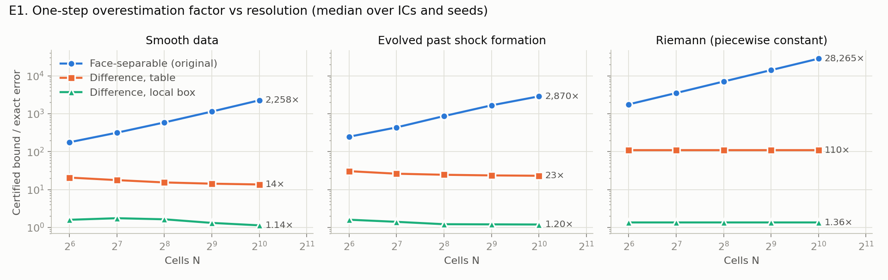
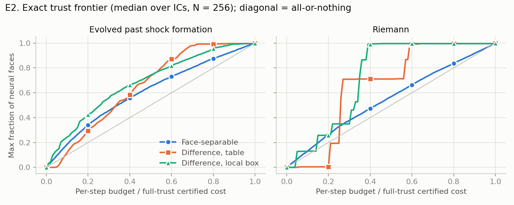
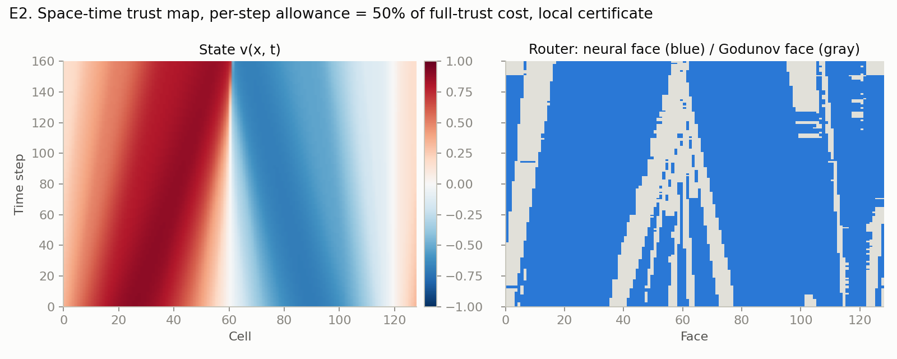
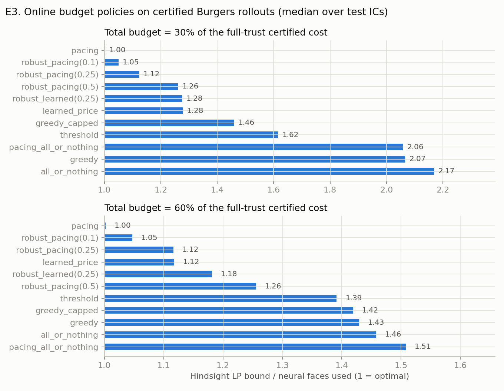
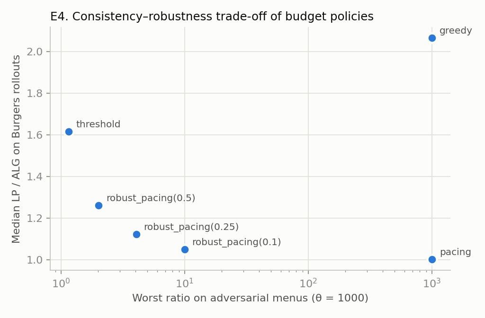
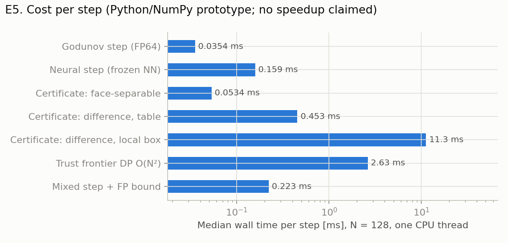

# Stage A2 validation report

Measured evidence for [`docs/stage_a2_theory.md`](../docs/stage_a2_theory.md). Every number below comes
from `python -m stage_ab.experiments_a2 --out outputs/stage_a2` (265 s, one CPU thread) and is stored in
[`stage_a2/`](stage_a2/). These are measurements, not performance claims.

**Environment.** Python 3.11.15, NumPy 2.4.4, PyTorch 2.14.0 (CPU, 1 thread), Cantera 3.2.0 for the
unchanged Stage B tests; Linux x86-64. Periodic Burgers, $\lambda=0.2$, envelope $M=2$.

**Regression.** Full suite: **75 passed** (47 original + 28 new in `tests/stage_ab/test_stage_a2.py`).

## Model

Width-16, two-hidden-layer ReLU flux, 6000 Adam steps with cosine decay on freshly sampled pairs
(uniform + near-diagonal + near sonic lines), 3 seeds. Fit on a 401×401 grid of $[-2,2]^2$:

| seed | sup error | mean error | sup consistency defect $\lvert F(u,u)-f(u)\rvert$ | train [s] |
|---:|---:|---:|---:|---:|
| 0 | 0.0473 | 0.0046 | 0.0137 | 9.7 |
| 1 | 0.0566 | 0.0065 | 0.0211 | 9.6 |
| 2 | 0.0336 | 0.0051 | 0.0185 | 8.7 |

The original Stage A model (200 full-batch epochs) had sup error 0.49 (review item A-4).
Certificate tables: 1.5 s (16 bins), 6.4 s (32 bins), including the 16³ or 32³ triple-box gradient tables.

## E1. Tightness versus resolution (Theorems 6.1–6.3)

One all-neural step; ratio of the certified bound (without update rounding) to the exact-rational
error $A(v)=\lambda h\sum_i|\hat e_i-\hat e_{i-1}|$. 12 initial conditions (4 smooth, 4 evolved past
shock formation, 4 Riemann) × 3 seeds; median over the 12 runs per cell.



| data | N | exact error | separable, 16 bins | separable, 32 bins | table diff., 16 | table diff., 32 | local diff. | irregular cells |
|---|---:|---:|---:|---:|---:|---:|---:|---:|
| smooth | 64 | 7.52e-4 | 177 | 83.6 | 20.8 | 14.5 | 1.60 | 43 |
| smooth | 256 | 2.09e-4 | 590 | 286 | 15.5 | 9.26 | 1.65 | 79 |
| smooth | 1024 | 5.40e-5 | 2,260 | 1,080 | 13.7 | 8.22 | **1.14** | 96 |
| shocked | 64 | 4.48e-4 | 248 | 121 | 30.6 | 15.8 | 1.61 | 47 |
| shocked | 256 | 1.12e-4 | 867 | 394 | 24.6 | 13.3 | 1.22 | 64 |
| shocked | 1024 | 3.18e-5 | 2,870 | 1,360 | 23.2 | 12.1 | **1.20** | 65 |
| Riemann | 64 | 5.95e-5 | 1,770 | 811 | 110 | 49.5 | 1.36 | 4 |
| Riemann | 1024 | 3.72e-6 | 28,300 | 13,100 | 110 | 49.5 | 1.36 | 4 |

(All five resolutions are in `e1_tightness.json`.)

* **Soundness.** In all 180 cases every certificate was at least the exact error.
* **Theorem 6.1.** The original (face-separable) certificate is flat in absolute terms (~0.1) while the
  error halves with each refinement, so the factor doubles: 177× → 2,260× on smooth data. Refining the
  table (16 → 32 bins) only halves the constant.
* **Theorem 6.2.** The table-difference factor is flat or slowly decreasing in $N$.
* **Theorem 6.3.** The local certificate's factor falls toward 1 on smooth data. Per-cell check: on every
  regular cell of all 180 runs, the gap stayed within $d^2+2(\varepsilon_{fp}+\varepsilon_{fp})$ without
  using the rounding term $r_i$. The gap is dominated by irregular cells: at $N=1024$ (smooth, median) the
  regular cells contribute $1.1\cdot10^{-6}$, the irregular ones $7.3\cdot10^{-6}$, against an exact error
  of $5.4\cdot10^{-5}$.
* **Irregular cells** grow from 43 to 96 on smooth data and are flat from $N=512$: bounded in $h$, as
  assumed in Corollary 6.4, but numerous (32 hidden units, each boundary crossed about twice by a sine).
  Riemann data has 4 irregular cells (the jumps), which hold the whole error; there the local factor stays
  at 1.36 rather than tending to 1.

## E2. Trust frontier and space–time routing (Theorem 7.1)



For each state the DP gives the largest number of neural faces for a given per-step certified cost.
The diagonal is the all-or-nothing rule. Under the local certificate, 20% of the full-trust cost buys
~43% of the faces after shock formation, and 40% buys ~99% on Riemann data (the jump faces are the
expensive ones).



Routing a sine to shock formation with a per-step allowance of 50% of the full-trust cost: the faces
returned to Godunov (gray) follow the compression region into the shock at cell ~60 and the sonic
expansion points near cells 0 and 110, where $G$ is nonsmooth. Everything else stays neural.

## E3. Online budget policies on certified rollouts (Theorems 4.2, 8.1, 8.3)

N = 128, 60 steps, local certificate. Total budget = 30% or 60% of the certified cost of trusting every
face in every step. 9 test initial conditions; the learned price is the median LP dual price of 6
disjoint calibration initial conditions. Value = neural faces used; LP = hindsight fractional optimum on
the realized menus (an upper bound on any allocation of those menus).



| budget | policy | neural faces | LP/ALG median | LP/ALG max | budget used |
|---|---|---:|---:|---:|---:|
| 30% | pacing | 0.689 | **1.003** | 1.015 | 0.965 |
| 30% | robust pacing, γ = 0.1 | 0.671 | 1.050 | 1.071 | 0.898 |
| 30% | robust pacing, γ = 0.25 | 0.647 | 1.124 | 1.161 | 0.819 |
| 30% | robust pacing, γ = 0.5 | 0.583 | 1.261 | 1.456 | 0.721 |
| 30% | learned price | 0.571 | 1.278 | 1.710 | 0.863 |
| 30% | robust learned price, γ = 0.25 | 0.494 | 1.275 | 2.157 | 0.761 |
| 30% | greedy with per-step cap | 0.469 | 1.460 | 1.631 | 0.977 |
| 30% | threshold (Theorem 8.1) | 0.492 | 1.616 | 1.978 | 0.759 |
| 30% | pacing, all-or-nothing | 0.267 | 2.057 | 4.801 | 0.902 |
| 30% | greedy | 0.326 | 2.066 | 2.529 | 0.984 |
| 30% | all-or-nothing (original rule) | 0.309 | 2.168 | 2.733 | 0.954 |
| 60% | pacing | 0.863 | **1.002** | 1.009 | 0.956 |
| 60% | robust pacing, γ = 0.1 | 0.838 | 1.047 | 1.065 | 0.880 |
| 60% | learned price | 0.789 | 1.118 | 1.255 | 0.873 |
| 60% | threshold | 0.692 | 1.392 | 1.523 | 0.728 |
| 60% | greedy | 0.605 | 1.430 | 1.508 | 0.970 |
| 60% | all-or-nothing | 0.593 | 1.458 | 1.548 | 0.959 |
| 60% | pacing, all-or-nothing | 0.539 | 1.508 | 2.172 | 0.890 |

(The 60% block shows a subset; every row is in `stage_a2/e3_budget.json`.)

* **Soundness.** In 66 fully audited rollouts (every third test IC, all policies, 60 steps each) every
  one-step certificate held against the exact-rational oracle and every global bound held against a
  floating Godunov reference plus its certified defect. No run exceeded its total budget (all 198).
* **Value of face-selective routing**, with the temporal rule fixed: pacing trusts 2.6× (30%) and 1.6×
  (60%) as many faces as pacing restricted to all-or-nothing.
* **Temporal rule.** Rollout menus are nearly stationary, so pacing is within 0.3% of the LP bound.
  Greedy spends the budget on full-trust steps early and is 1.4–2.1× off. The worst-case threshold policy
  under-spends (73–76% of the budget) and is 1.4–1.6× off. The learned price does not transfer well
  between initial conditions whose error scales differ (1.12–1.28×).
* Threshold parameters: $\alpha=1+\ln\theta\in[10.4,13.6]$, $\theta\in[1.2\cdot10^4,3\cdot10^5]$,
  $\hat w\le 0.096$. The worst-case guarantee of Theorem 8.1 is therefore loose here; it is a safety net,
  not a predictor of typical performance.

## E4. Lower-bound instances (Propositions 8.4, 8.5) and the trade-off

Ratio LP/ALG ($m=200$ items per block, $T=50$ for the burst instance):

| θ | instance | greedy | pacing | threshold | robust pacing 0.1 | 0.25 | 0.5 |
|---:|---|---:|---:|---:|---:|---:|---:|
| 10 | low then high | 10.05 | 1.01 | 1.39 | 1.03 | 1.08 | 1.17 |
| 10 | high then low | 1.01 | 10.05 | 1.01 | 5.28 | 3.13 | 1.84 |
| 10 | burst | 1.00 | 50.00 | 1.00 | 10.00 | 4.00 | 2.00 |
| 1,000 | low then high | 1,005 | 1.01 | 1.15 | 1.02 | 1.04 | 1.08 |
| 1,000 | high then low | 1.01 | 1,005 | 1.01 | 9.91 | 4.07 | 2.02 |
| 1,000 | burst | 1.00 | 50.00 | 1.00 | 10.00 | 4.00 | 2.00 |
| 10,000 | low then high | 10,050 | 1.01 | 1.12 | 1.02 | 1.04 | 1.06 |
| 10,000 | high then low | 1.01 | 10,050 | 1.01 | 9.99 | 4.08 | 2.02 |



Greedy fails by θ exactly as Proposition 8.4 predicts; pacing fails by θ and by $T=50$ (Proposition 8.5).
The threshold policy never exceeded 1.39. Robustified pacing's worst case was about $1/\gamma$. Combining
E3 and E4: pacing is best on Burgers but unbounded in the worst case; robust pacing with γ = 0.1 costs 5% on
Burgers and was at most 10× off on the adversarial suite.

## E5. Cost (no speedup claimed)

Median wall time per step, one thread, shocked state:

| component | N = 128 | N = 512 |
|---|---:|---:|
| Godunov step (FP64) | 0.035 ms | 0.041 ms |
| neural step (frozen network) | 0.159 ms | 0.388 ms |
| certificate: face-separable (original) | 0.053 ms | 0.077 ms |
| certificate: difference, table | 0.453 ms | 0.612 ms |
| certificate: difference, local box | 11.3 ms | 23.9 ms |
| trust frontier DP, $O(N^2)$ | 2.63 ms | 12.4 ms |
| mixed step + FP defect bound | 0.223 ms | 0.493 ms |



For Burgers the classical solver is the cheapest component and the local certificate costs ~320× a
Godunov step (Python/NumPy interval arithmetic). The routing machinery saves *solver face evaluations*;
it pays only when the per-face solver is expensive relative to network plus verifier (e.g. per-cell stiff
chemistry). The review's measurement that vectorized rational arithmetic was the Stage A bottleneck
(A-3) is resolved: the FP defect bound now costs one vectorized pass instead of $N$ `Fraction` operations.

## Status of the Stage A review items (66fb53a)

| item | status |
|---|---|
| A-1 fallback not kept in $K$ (soundness) | fixed in both rollouts (clip, Lemma 2.4) |
| A-2 digest recomputed per lookup | new `CertifiedFlux` computes it once; weights are read-only |
| A-3 per-step `Fraction` roundoff | replaced by a priori vectorized bounds (Lemmas 3.4–3.6) |
| A-4 underfit flux | sup error 0.49 → 0.034–0.057 |
| A-5 table dominated by the variation of $G$ | difference certificates (Section 5) |
| A-6 Lipschitz/hybrid construction slow and no tighter | superseded; not used by Stage A2 |
| A-7 non-monotone learned flux | not addressed (monotone-structure certificate remains future work) |
| A-8 OOD defined in state space | not addressed |
| A-9 inconsistent thresholds in the policy comparison | Stage A2 compares all policies against the same LP bound |
| A-10 H = 1 cannot accelerate | unchanged and stated (E5) |

## Not claimed

No error bound with respect to the PDE solution; no acceleration; no formal verification of the
arithmetic assumptions H1–H2; competitive ratios are against the hindsight optimum on realized menus;
novelty of Sections 4–7 has not been checked against the literature. See Section 10 of the theory note.

## Reproduce

```bash
python -m pip install -r requirements-stage-ab.txt
OMP_NUM_THREADS=1 python -m pytest -q
python -m stage_ab.experiments_a2 --out outputs/stage_a2
python -m stage_ab.plots_a2 outputs/stage_a2
```
